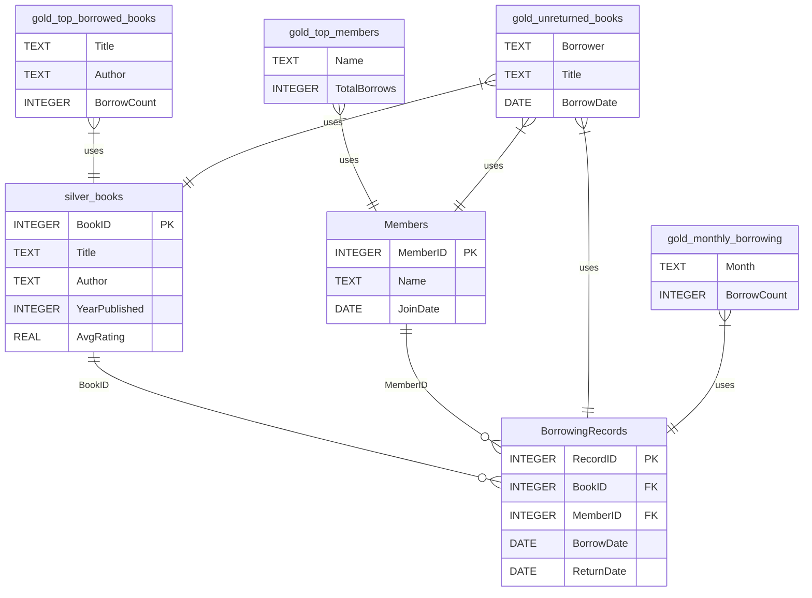

# 📚 BookBase

**BookBase** is a practical toy project focused on exploring **SQLite server**, **SQL**, and **Python integration** within a real-world scenario: managing and analysing library data.

While the project began as a test bed for learning, it naturally evolved into a lightweight data pipeline inspired by the **Medallion Architecture** (Bronze, Silver, Gold) - adding structure and analytical depth to the process.

## 🎯 Project Purpose

- ✅ Practice working with **SQLite** using Python (`sqlite3`, `pandas`)
- ✅ Learn how to structure data pipelines using SQL
- ✅ Explore the use of **views**, **joins**, and **aggregations**
- ✅ Simulate realistic datasets (e.g. book borrowing activity)
- ✅ Apply principles of the Medallion architecture in a simple context

## 🧱 Architecture (Medallion-Inspired)

Although this is a learning-focused project, we organised the data into Medallion layers to make the flow clearer and more modular:

### 🟫 Bronze Layer – Raw Data
- CSV data loaded directly into `bronze_books` (e.g. from [Goodreads](https://www.kaggle.com/datasets/jealousleopard/goodreadsbooks))

### 🪙 Silver Layer – Cleaned/Modelled
- Trimmed, filtered, and renamed data in `silver_books`
- Synthetic `Members` and `BorrowingRecords` tables created
- Foreign key relationships used to simulate a real schema

### 🥇 Gold Layer – Analytical Views
- SQL views created for analysis:
  - `gold_top_borrowed_books`
  - `gold_top_members`
  - `gold_unreturned_books`
  - `gold_monthly_borrowing`

## 🔧 Technologies

- **SQLite**: Lightweight database for testing and prototyping
- **Python**: Data handling, simulation, and SQL execution
- **Pandas**: Easy CSV import and SQL query output
- **Jupyter Notebook**: All-in-one development and experimentation

## 🧪 Features Explored

- Creating and managing relational tables
- Writing and executing SQL queries in Python
- Generating synthetic data with realistic structure
- Joining data across tables
- Using views for reporting and reusability

## Tables and View

