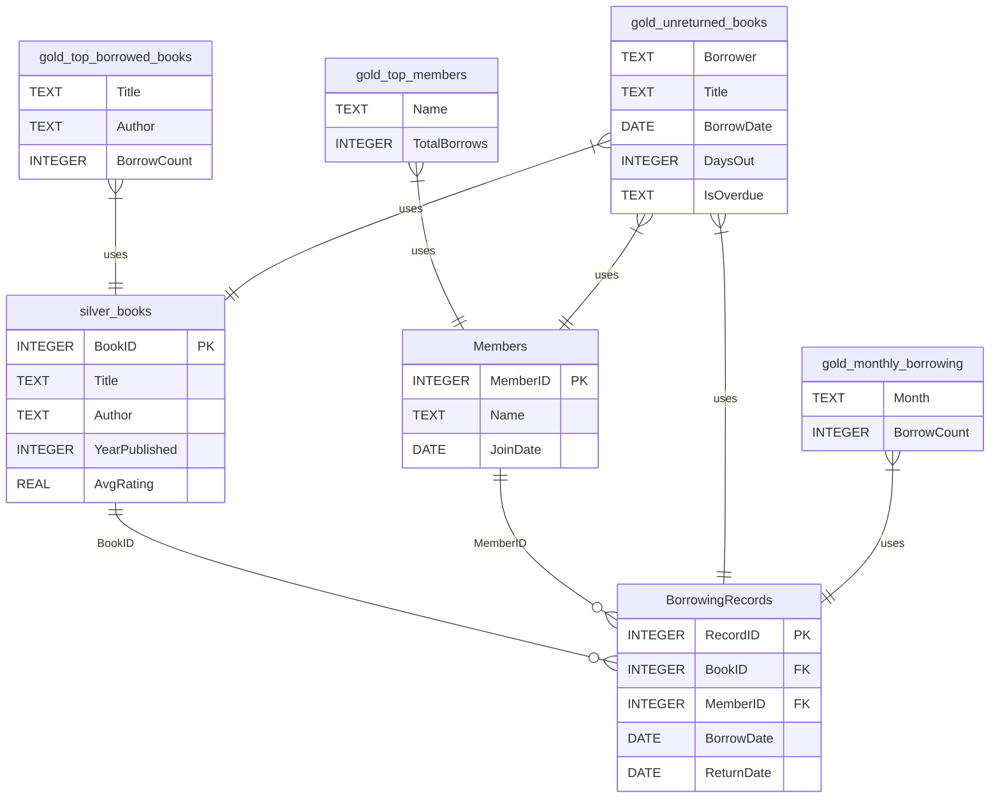
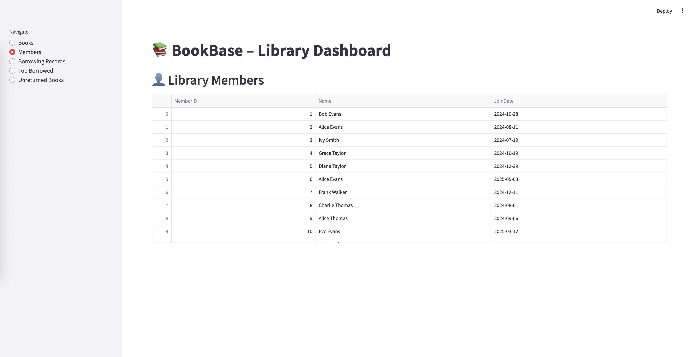
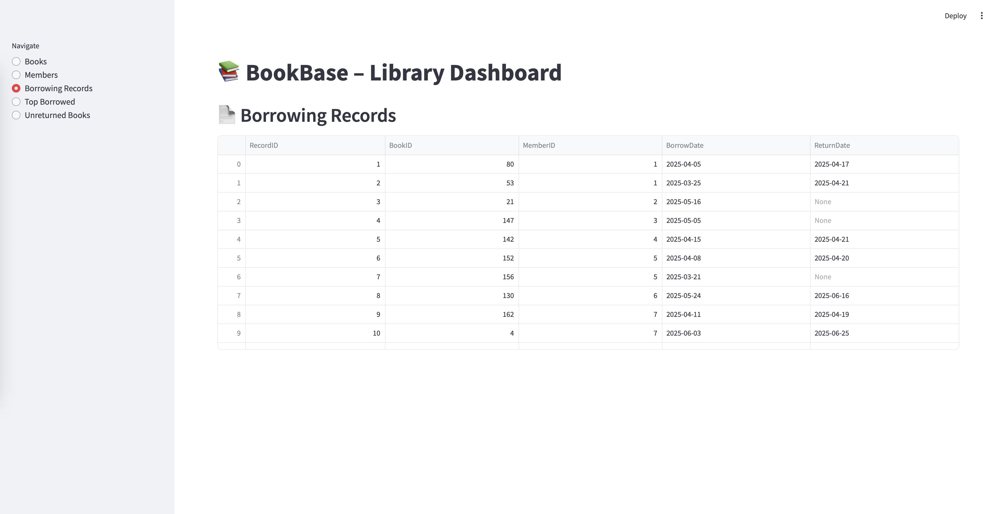
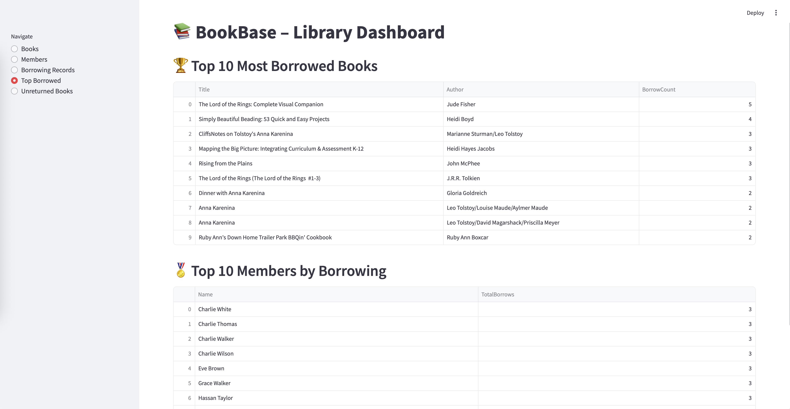
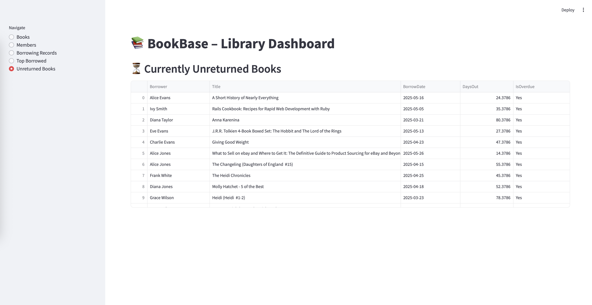

# 📚 BookBase

**BookBase** is a practical toy project focused on exploring **SQLite**, **SQL**, and **Python integration** within a real-world scenario: managing and analysing library data.

While the project began as a test bed for learning, it naturally evolved into a lightweight data pipeline inspired by the **Medallion Architecture** (Bronze, Silver, Gold) — adding structure and analytical depth to the process. It now includes a **Streamlit interface** for interactive data exploration.


## Project Purpose

- Practice working with **SQLite** using Python (`sqlite3`, `pandas`)
- Learn how to structure data pipelines using SQL
- Explore the use of **views**, **joins**, and **aggregations**
- Simulate realistic datasets (e.g. book borrowing activity)
- Apply principles of the Medallion architecture in a simple context
- Build a user interface using **Streamlit**

## Architecture (Medallion-Inspired)

Although this is a learning-focused project, we organised the data into Medallion layers to make the flow clearer and more modular:

### Bronze Layer – Raw Data
- CSV data loaded directly into `bronze_books` (e.g. from [Goodreads](https://www.kaggle.com/datasets/jealousleopard/goodreadsbooks))

### Silver Layer – Cleaned/Modelled
- Trimmed, filtered, and renamed data in `silver_books`
- Synthetic `Members` and `BorrowingRecords` tables created
- Foreign key relationships used to simulate a real schema

### Gold Layer – Analytical Views
SQL views created for analysis:
- `gold_top_borrowed_books`
- `gold_top_members`
- `gold_unreturned_books`
- `gold_monthly_borrowing`

Each view performs meaningful aggregations, groupings, or joins to answer business-like questions such as:
- Who borrowed the most?
- Which books are most popular?
- What books are still unreturned?

## 🔧 Technologies Used

- **SQLite**: Lightweight, serverless SQL database
- **Python**: For simulation, SQL execution, and logic
- **Pandas**: Easy CSV imports and SQL result handling
- **Jupyter Notebook**: Used for development and data wrangling
- **Streamlit**: For building a simple, interactive UI
- **Mermaid.js**: For entity-relationship diagrams

## ✨ Features Explored

- Creating and managing relational tables
- Writing and executing SQL queries in Python
- Generating synthetic data with realistic structure
- Joining data across tables with `JOIN`
- Using `VIEWS` for reporting and reusability
- Calculating derived metrics (`DaysOut`, `IsOverdue`)
- Building an interactive Streamlit dashboard


## Tables and Views



## 📄 Streamlit Interface

|  Available Books | Library Members | Borrowing Records  |
|--------------|--------------|--------------|
|  |  |  |

| Top 10 Most | Currently Unreturned Books |
|--------------|--------------|
|  |  |

The `Streamlit` UI lets users:
- View books, members, and borrow records
- See top borrowed books and members
- View all currently unreturned books

Run it with:
```bash
streamlit run app.py
```
